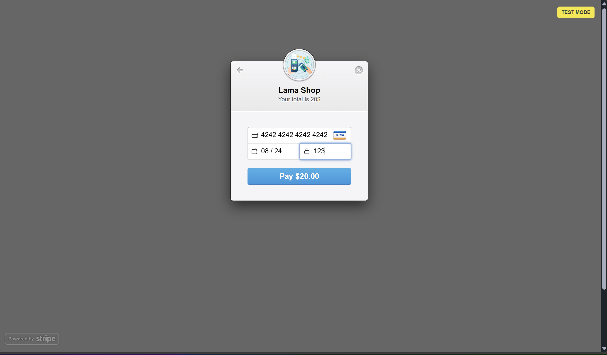
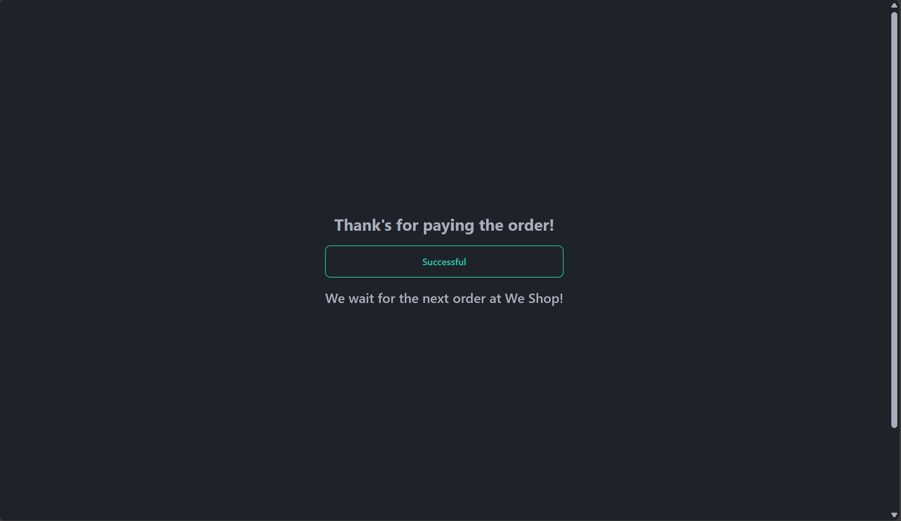
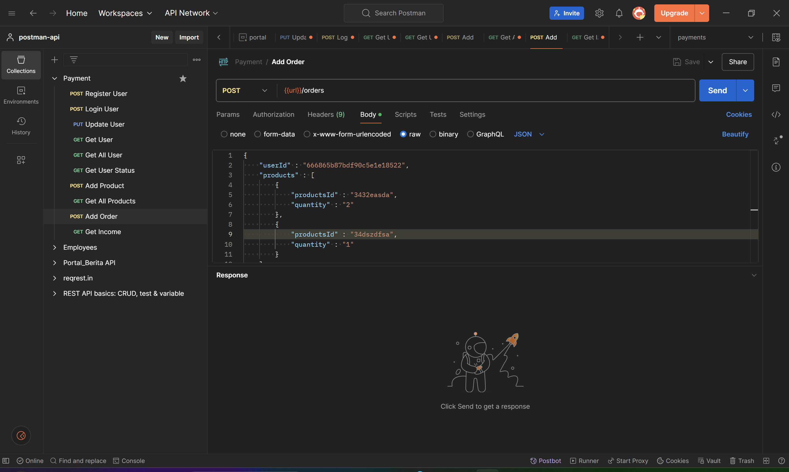

# Payment CRUD Rest API
Sebuah fitur pembayaran aplikasi website dengan api stripe dan CRUD rest API dengan menggunakan NodeJS


## Daftar Isi
- [Tumpukan Teknologi](#tumpukan-teknologi)
- [Fitur](#fitur)
- [Dokumentasi Halaman](#dokumentasi-halaman)
- [Cara Instalasi](#cara-instalasi)
- [Cara Penggunaan](#cara-penggunaan)

## Tumpukan Teknologi
### Frontend
- **ReactJS**: Perpustakaan UI untuk membangun antarmuka pengguna
- **Tailwind CSS**: Kerangka kerja CSS berbasis utilitas
- **Vite**: Alat pengembangan front-end generasi berikutnya untuk pengembangan yang lebih cepat

### Backend
- **Node.js**: Lingkungan runtime untuk menjalankan JavaScript di server
- **Express.js**: Kerangka kerja web untuk Node.js

### API
- **Stripe**: API pembayaran untuk memproses transaksi online

### DBMS
- **MongoDB**: Database NoSQL untuk menyimpan data aplikasi.

## Fitur
- **Pembayaran**: fitur untuk melakukan transaksi pembayaran online
- **Autentikasi Pengguna**: pengguna dapat melakukan autentikasi sebelum masuk ke website nantinya dengan login pengguna terlebih dahulu dan dapat juga melakukan pendaftaran
- **Update Pengguna**: pengguna juga dapat melakukan update data pengguna
- **Data Produk**: pengguna dapat menambah maupun melihat data produk 
- **Data Pesanan**: pengguna dapat menambahkan pesanan 
- **Data Penghasilan**: pengguna dapat melihat data penghasilan produk dari pesanan

## Dokumentasi Halaman
##### 1. Halaman Tombol Pemesanan

##### 2. Halaman Billing Pembayaran

##### 3. Halaman Pembayaran

##### 4. Halaman Sukses Pembayaran

##### 5. Halaman Testing CRUD REST API



## Cara Instalasi
```bash
# Clone repository ini
git clone https://github.com/defrijay/payments-features-and-crud-restful-api.git

# Masuk ke direktori proyek
cd payments-features-and-crud-restful-api

# Instal dependensi
npm install
npm add nodemon

# Jalankan server frontend secara live
npm run dev --watch

# Jalankan server backend secara live
nodemon

# Buka url server frontendnya
http://localhost:5173/

# Buka website url dan isi .env lebih tepatnya STRIPE_KEY= dengan publishable key nya

# Import collections postman dan data users di mongoDB

# Dan jangan lupa untuk conncet atlas cluster dengan mengisi MONGO_URL= di .env

```

## Cara Penggunaan
1. Untuk melakukan pembayaran dapat mengisi data bebas. Namun saat pembayaran anda dapat menggunakan card number `4242 4242 4242 4242`, tanggal `08/24`, dan password CVC `123`
2. Dan untuk melakukan testing API dapat menggunakan postman yang dimana diperlukan registrasi akun terlebih dahulu, yang kemudian login di postman

**Catatan**
Terdapat beberapa testing API yang memerlukan user sebagai admin untuk melakukan testing API seperti saat `GET Income` oleh karena itu anda dapat login dengan username `admin2` dan password `admin2`


